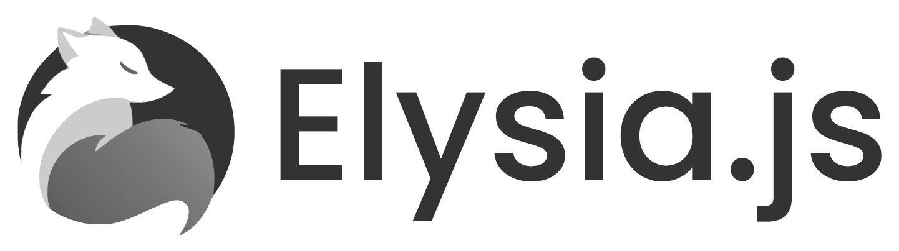

  
  

## Table of content

- [0. User Stories and Mockups](#0-user-stories-and-mockups)  
  - [0.1 User Stories](#01-user-stories)  
  - [0.2 Mockups (Main Screens)](#02-mockups-main-screens)  
- [1. Design System Architecture](#1-design-system-architecture)  
- [2. Components, Classes & Database Design (MVP)](#2-components-classes--database-design-mvp)  
  - [2.1 Front-end Components (React)](#21-front-end-components-react)  
  - [2.2 Back-end Classes ( à voir )](#22-back-end-classes-nodejs--express)  
  - [Backend Components Overview](#backend-components-overview)  
  - [Relational Database (MVP)](#relational-database-mvp)  
- [3. High-Level Sequence Diagrams (MVP)](#3-high-level-sequence-diagrams-mvp)  
  - [3.1 User Login (JWT)](#31-user-login-jwt)  
  - [3.2 Report Harassment](#32-Report-an-harassment)  
  - [3.3 Chatbot conversation](#33-Chatbot-conversation)  
- [4. API & Methods](#4-api--methods)  
  - [4.1 External APIs Used](#41-external-apis-used)  
  - [4.2 Internal API Endpoints (MVP)](#42-internal-api-endpoints-mvp)  
- [5. SCM & QA Strategy](#5-scm--qa-strategy)  
  - [5.1 Source Control Management (SCM)](#51-source-control-management-scm)  
  - [5.2 QA (Quality Assurance)](#52-qa-quality-assurance)  
  - [5.3 Deployment Pipeline](#53-deployment-pipeline)  
---

  
  
  
  
  

  <b>Bun.js</b> • <b>Flutter</b> • <b>PostgreSQL</b> • <b>Prisma</b> • <b>ElysiaJS</b>

## 0 User stories and Mockups

### 0.1 User Stories

#### Must Have (MVP)
- As a **student**, I want to **register and log in** to have my own account and report safely
- As a **student**, I want to **choose my level of anonymity**, so I can report harassment safely
- As a **student**, I want to **report harassment**, as a victim or a witness
- As a **student**, I want to **chat with chatbot**, so I can explain safely what I experienced or saw
- As a **student**, I want to **find emergency numbers**, so I can find solutions to my problems
- As a **student**, I want to **see my previous reports**, so I can see the progress.

- As a **supervisor**, I want to **register and log in** to have my own account and manage the reports
- As a **supervisor**, I want to **see the dashbord** to manage safely all the reports
- As a **supervisor**, I want to **see the progress of reports** with color rating
- As a **supervisor**, I want to **manage my teams** to handle reports safely
- As a **supervisor**, I want to **have an access to the onitoring of the situations**
- As a **supervisor**, I want to **have statistical analysis**, to detect trends, clusters or predict risks.

- As a **parent**, I want to **see the progess of my child reports**
- As a **perent**, I want to **have the school phone number**, to cal them if I need informations.

#### Should Have (important but not critical for MVP)
- As a **student**, I want to **have a progress timeline**, to see my report progress
- As a **student**, I want to **delete my report** if I need/want to.

- As a **supervisor**, I want to **download closed reports** to archive them
- As a **supervisor**, I want to **filter reports** to quickly find what I want
- As a **supervisor**, I want to **see live notifications** in case of emergency reports.

#### Could Have (nice to have, next update)
- As a **student**, I want to **upload pictures or videos** to argue my report
- As a **student**, I want to **change color mode** so I can adapt the screen to my needs.

- As a **supervisor**, I want to **write team suggestion**, so I can handle situations safely
- As a **supervisor**, I want to **know probable peaks**, so I can schedule teams based on that.

#### Won't Have (what Haven don't do)
- As a **student**, I don't want **chatbot take decision for me**, it's too dangerous
- As a **student**, I don't want **to forget the emergency numbers**, if I'm in danger I have to use them

- As a **supervisor**, I don't want **to replace the pHARE protocol**, Haven is a complementary tool
- As a **supervisor**, I don't want to **make a medical diagnosis**, Haven is an alert tool.

